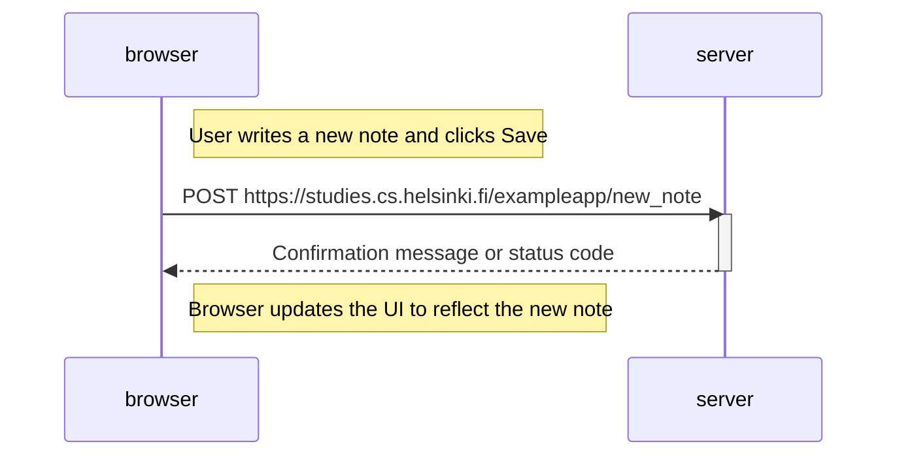

# Sequence Diagram: User Creates a New Note

Create a similar diagram depicting the situation where the user creates a new note on the page https://studies.cs.helsinki.fi/exampleapp/notes by writing something into the text field and clicking the Save button.

If necessary, show operations on the browser or on the server as comments on the diagram.

## Explanation:

1) The user writes a new note and clicks the Save button in the browser.

2. The browser sends a POST request to the server to create a new note:  
   `browser->>server: POST https://studies.cs.helsinki.fi/exampleapp/new_note`

4. The server processes the request, activates, and sends back a confirmation message or status code to the browser:  
   `activate server`
   `server-->>browser: Confirmation message or status code`
   `deactivate server`

5. The browser updates the UI to reflect the new note:  
   `Note right of browser: Browser updates the UI to reflect the new note`

This diagram outlines the sequence of events when a user creates a new note on the page. The user input is sent to the server via a POST request, and upon successful processing, the browser updates the UI to display the new note.
