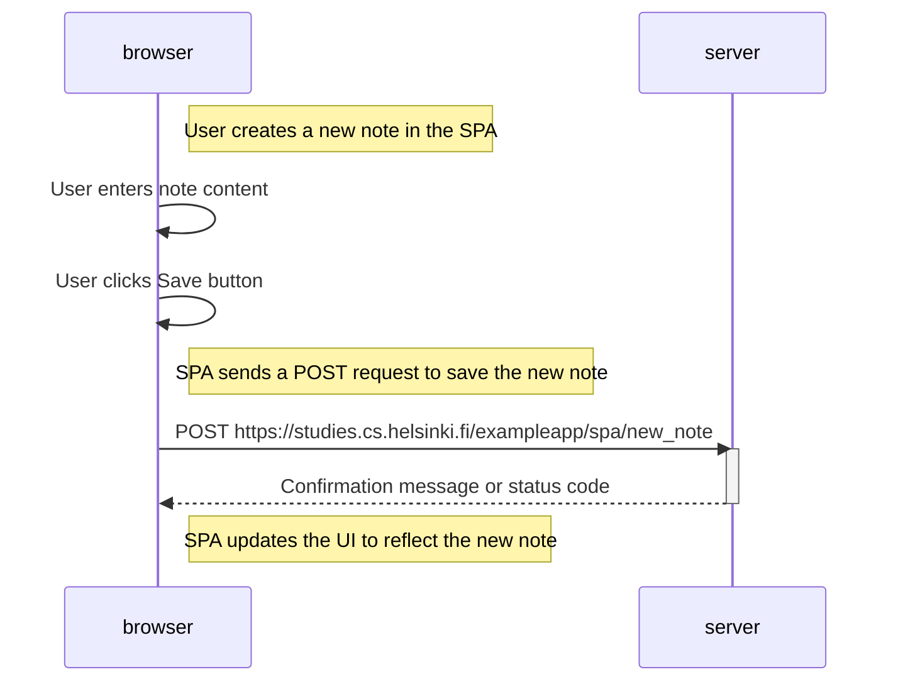

# Sequence Diagram: User Creates a New Note in SPA Version

Create a diagram depicting the situation where the user creates a new note using the single-page version of the app.

## Explanation:

1. The user creates a new note in the Single-Page App (SPA) version:  
   `Note right of browser: User creates a new note in the SPA`

2. The user interacts with the browser by entering note content and clicking the Save button:  
   `browser->>browser: User enters note content`
   `browser->>browser: User clicks Save button`

3. A note in the diagram indicates that the SPA sends a POST request to save the new note:  
   `Note right of browser: SPA sends a POST request to save the new note`

4. The browser sends a POST request to the server to create a new note in the SPA:  
   `browser->>server: POST https://studies.cs.helsinki.fi/exampleapp/spa/new_note`

5. The server processes the request, activates, and sends back a confirmation message or status code to the browser:  
   `activate server`
   `server-->>browser: Confirmation message or status code`
   `deactivate server`

6. Another note in the diagram indicates that the SPA updates the UI to reflect the new note:  
   `Note right of browser: SPA updates the UI to reflect the new note`

This diagram illustrates the sequence of events when a user creates a new note in the Single-Page App (SPA) version of the notes app. The user input is sent to the server via a POST request, and upon successful processing, the SPA updates the UI to display the new note.
