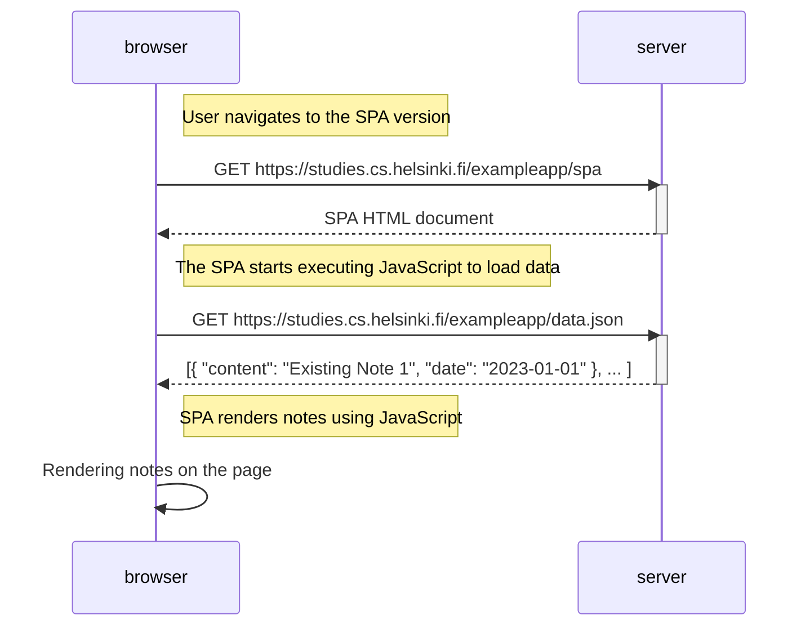

# Sequence Diagram: User Navigates to Single-Page App (SPA) Version

Create a diagram depicting the situation where the user goes to the single-page app version of the notes app at https://studies.cs.helsinki.fi/exampleapp/spa.

## Explanation:

1. The user navigates to the Single-Page App (SPA) version of the notes app:  
   `Note right of browser: User navigates to the SPA version`

2. The browser sends a GET request to the server to retrieve the SPA HTML document:  
   `browser->>server: GET https://studies.cs.helsinki.fi/exampleapp/spa`

3. The server processes the request, activates, and sends back the SPA HTML document to the browser:  
   `activate server`
   `server-->>browser: SPA HTML document`
   `deactivate server`

4. A note in the diagram indicates that the SPA starts executing JavaScript to load data:  
   `Note right of browser: The SPA starts executing JavaScript to load data`

5. The browser sends a request to the server to get the JSON data:  
   `browser->>server: GET https://studies.cs.helsinki.fi/exampleapp/data.json`

6. The server processes the request, activates, and sends back the JSON data to the browser:  
   `activate server`
   `server-->>browser: [{ "content": "Existing Note 1", "date": "2023-01-01" }, ... ]`
   `deactivate server`

7. Another note in the diagram indicates that the SPA renders notes on the page using JavaScript:  
   `Note right of browser: SPA renders notes using JavaScript`

8. The browser internally renders the notes on the page using JavaScript:  
   `browser->>browser: Rendering notes on the page`

This diagram illustrates the sequence of events when a user navigates to the Single-Page App (SPA) version of the notes app. The SPA loads the HTML document, fetches data asynchronously, and renders the notes on the page dynamically using JavaScript.
